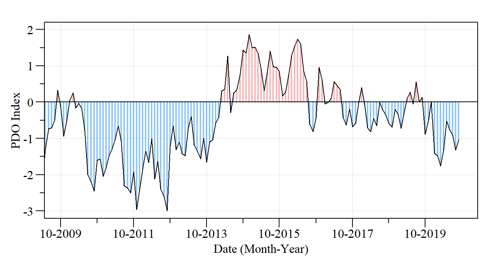
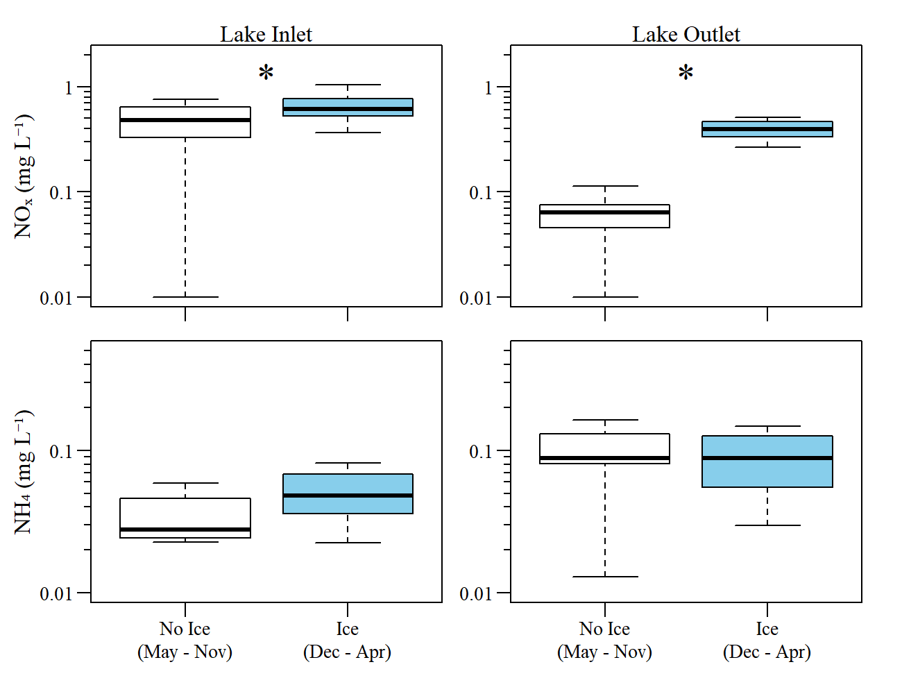

```{r xaringanExtra, include=FALSE, warnint=FALSE}
# devtools::install_github("gadenbuie/xaringanExtra")
# xaringanExtra::use_webcam()
xaringanExtra::use_tile_view()
# xaringanExtra::use_scribble()
# xaringanExtra::use_progress_bar("red", "bottom","0.25em")
```

```{r setup, include=FALSE}
library(knitr)

options(htmltools.dir.version = FALSE)
knitr::opts_chunk$set(warning = FALSE, message = FALSE, echo=FALSE)

##
library(flextable)
library(magrittr)
library(plyr)
library(reshape2)

wd="C:/Julian_LaCie/_GitHub/ATRAPP"

plot.path=paste0(wd,"/Plots/PLSF_winter/")
export.path=paste0(wd,"/Export/")

plot.figs=list.files(plot.path,full.names=T)

slides.figs=paste0(wd,"/slides/plots/winter/")
file.copy(plot.figs,slides.figs,overwrite=T,recursive=T)


```

layout: true

---
name: title
class: left, middle

### Petit-lac-Saint-François - Winter Limnology

`r paste(format(as.Date("2022-10-18"),"%B %d, %Y"),"<br>(Updated:", format(as.Date(Sys.Date()),"%B %d, %Y"),")")`


<!-- this ends up being the title slide since seal = FALSE-->


.footnote[
Paul Julian PhD [`r fontawesome::fa("fas fa-envelope")`](mailto: paul.julian@umontreal.ca) .small[paul.julian@umontreal.ca]

.small[Use cursor keys for navigation, press .red["O"] for a slide .red[O]verview]

```{r} 
bsplus::bs_button(
    label = "Download PDF Version",
    button_type = "primary",
    button_size = "small") %>%
    htmltools::a(
      href = "https://swampthingecology.org/ATRAPP/slides/ATRAPP_PLSF_Winter.pdf"
      )
```
]

---
name: objectives

## Objective(s)/Goal(s)

* Examine total and dissolved nutrients during winter in a seasonally ice-covered lake focusing on the link between inorganic nutrient changes and ice duration (similar to Powers et al. 2017)

* ??

## Hypotheses

* Due to changes to the physical structure of the lake and the constraints that lake ice places on energy and material fluxes (Cavaliere et al 2021) concentrations of dissolved inorganic nutrients (i.e. DIN and SRP) will be greater in the winter/ice period; 

* Inorganic  nutrient accumulation rates will be sensitive to regional and local climate metrics (i.e. FDD, PDO, etc.) resulting in shorter periods of ice cover and therefore less time to accumulate .

---
name: pdo

```{r,out.width="80%",fig.align="center",fig.cap="Monthly Pacific Decadal Oscillation Index values from 2009 to 2022." }


```

* El Nino-Southern Oscillation events affect climatic conditions in the region (Shabbar et al 1997)
* Impact of global warming is expressed mainly in winte
* Small shallow lakes can be susceptible to changes in winter hydrology, water level, and associated ecological interactions (McGowan et al 2005)
* Precipitation patterns in Canada are influenced by shorter timescale teleconnections such as the PDO

---
name: climate.plot

```{r,out.width="80%",fig.align="center",fig.cap="Long term trend in winter mean air temp and cumulative freezing degree days" }


```

* Winter mean air temp vs year: $\tau$ = 0.38 $\rho$-value < 0.01
* FDD vs year: $\tau$ = -0.44 $\rho$-value < 0.01

---
name: ice cover1

```{r,out.width="100%",fig.align="center",fig.cap="Ice on/off dates for PLSF" }


```

Generally, ice on/off dates are moving to the top left corner of the plot suggesting later ice-on dates and earlier ice-off dates. But there is some variability in this limited time-series. 
* Could remote sensing data be used to fill in the data gaps? 

---
name: ice cover2

```{r,out.width="80%",fig.align="center",fig.cap="Comparison of ice coverage duration" }

knitr::include_graphics("./plots/winter/PLSF_IceCover_dur.png")
```

When comparing more recent data to the reference period of 1975 - 1977 (and 1982) the median ice cover duration has declined (not statistically significant) and become more variable. This could suggests a more dynamic/variable climate.

---
name: P_ice period


```{r,out.width="80%",fig.align="center",fig.cap="Comparison of average phosphorus concentrations between ice coverage period" }


```

* Asterisk indicates statistically significant ( $\rho$ -value<0.05 based on Kruskal-Walllis Test).
* Based on Year starting in May. 

---
name: N_ice period


```{r,out.width="80%",fig.align="center",fig.cap="Comparison of average nitrogen concentrations between ice coverage period" }

knitr::include_graphics("./plots/winter/PLSF_SeaComp_N.png")
```

* Asterisk indicates statistically significant ( $\rho$ -value<0.05 based on Kruskal-Walllis Test).
* Based on Year starting in May. 

---
name: N_ice period2


```{r,out.width="80%",fig.align="center",fig.cap="Comparison of average inorganic nitrogen concentrations between ice coverage period" }


```


* Lake Outlet comparison of NO_x_ is consistent with Powers et al 2017 indicating an accumulation of NO_x_ during the ice-cover period.
* But we also see an increase in NO_x_ concentration from the watershed via Lake Inlet. 
  * Denitrification reactions are slow down in winter? (changes in loading?)
  
---
name: N_ice period2


```{r,out.width="80%",fig.align="center",fig.cap="Comparison of average algal pigment concentrations between ice coverage period" }

knitr::include_graphics("./plots/winter/PLSF_SeaComp_Algae.png")
```

* Limited period of record (2016 - 2021)
* Obviously algal pigments decline during Ice period (limited light attenuation, below optimum temp, etc.)

---
name: pdo_v_wq

### PDO vs WQ

```{r}
winter.pdo.wq=read.csv(paste0(export.path,"winter_pdo_cor.csv"))

cap.val="Spearman's correlation results comparing water quality parameters with monthly PDO values during winter months (Dec - Feb)"

winter.pdo.wq%>%
  flextable()%>%
  colformat_double(j=3:4,digits=2,na_str = "---")%>%
  compose(j="variable",i=~variable=="TP.ugL",value=as_paragraph('TP (\u03BCg L\u207B\u00B9)'))%>%
  compose(j="variable",i=~variable=="SRP.ugL",value=as_paragraph('SRP (\u03BCg L\u207B\u00B9)'))%>%
  compose(j="variable",i=~variable=="TN.mgL",value=as_paragraph('TN (mg L\u207B\u00B9)'))%>%
  compose(j="variable",i=~variable=="DIN.mgL",value=as_paragraph('DIN (mg L\u207B\u00B9)'))%>%
  compose(j="Site",i=~Site=="Godbout",value=as_paragraph('Lake Inlet'))%>%
  compose(j="Site",i=~Site=="Lake_Outlet",value=as_paragraph('Lake Outlet'))%>%
  merge_v(j="Site")%>%
  compose(j="p.val",i=~p.val<0.05,value=as_paragraph('< 0.05'))%>%
  compose(j="p.val",i=~p.val<0.01,value=as_paragraph('< 0.01'))%>%
  set_header_labels("Site"="Site",
                    "variable" = "Parameter",
                    "r.val" = "r",
                    "p.val"="\u03C1-value")%>%
  width(width=c(1,1,0.75,0.75))%>%
  #align(align="center",part="header")%>%
  align(j=1:2,align="left",part="all")%>%
  valign(j=1,valign="top")%>%
  align(j=3:4,align="center",part="all")%>%
  hline(i=4)%>%
  padding(padding=1.5,part="all")%>%
  fix_border_issues()%>%
  font(fontname="Times New Roman",part="all")%>%
  fontsize(size=10,part="all")%>%
  fontsize(size=11,part="header")%>%
  add_header_lines(values=cap.val)%>%
  align(align="center",part="header")%>%fontsize(size=12,part="header")%>%font(fontname = "Times New Roman",part="all")

```


* Inlet and Outlet driven by different processes.

* Might need to evaluate discharge values to provide some clarity?
  * Use monthly FWM concentrations vs PDO to remove the effect of run-off/snow melt dilution? 
  * Negative PDO climate has a tendency to bring above normal precipitation  
  
* SRP correlation driven by non-detects

???
https://climateimpactcompany.com/february-2022-pdo-amo-outlook-2-2/#:~:text=%2DPDO%20has%20a%20tendency%20to,conditions%20in%20the%20Southeast%20States.

---
name: pdo_v_wq2

### PDO vs WQ


```{r,out.width="80%",fig.align="center",fig.cap="Correlation of WQ vs monthly PDO during winter months" }


```


---
name: daysIce

### Days of Ice vs WQ


```{r,out.width="80%",fig.align="center",fig.cap="Correlation of WQ vs number of days since Ice On during the POR" }


```

---
name: TCI

### Temperature Change Index 


```{r,out.width="80%",fig.align="center",fig.cap="Total and dissolved inorganic nutrients vs temperature change index with segmented regression (i.e. change points)" }


```